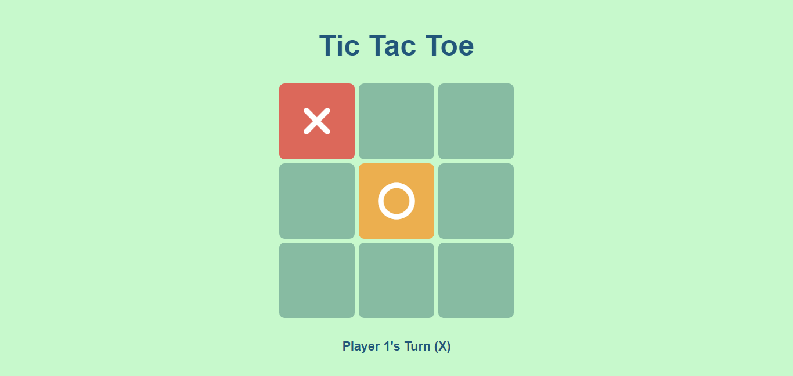

# Tic Tac Toe Game - Multiplayer



Welcome to the Tic Tac Toe Game project! This classic game is implemented with HTML5, CSS3, and JavaScript. Challenge a friend and see who can align three symbols in a row to win!


## Live Demo

Check out the live demo of the Tic Tac Toe Game [here](https://chauhan-hardik.github.io/Tic-Tac-Toe/).

## Features

- **User-friendly Interface:** Enjoy a clean and intuitive design for a smooth gaming experience.

- **Responsive Layout:** The game adapts to different screen sizes, making it enjoyable on various devices.

- **Player Turn Indication:** Clearly see whose turn it is with a player turn indicator.

- **Winning and Draw Messages:** Receive messages indicating the winner or a draw after each game.

- **Restart Game:** Start a new game easily with the restart button.

## How to Play

1. **Game Grid:**
   - The game grid consists of a 3x3 board.

2. **Player Turns:**
   - Players take turns to place their symbol (X or O) on an empty space.

3. **Winning Condition:**
   - The player who aligns three of their symbols in a row, column, or diagonal wins.

4. **Draw:**
   - If the grid is filled and no player has won, the game is a draw.

5. **Restart Game:**
   - Click the restart button to start a new game.

## Installation

1. Clone the repository to your local machine:

   ```bash
   git clone https://github.com/chauhan-hardik/Tic-Tac-Toe.git

## Contributing
Contributions are welcome! If you have ideas for improvements, find bugs, or want to enhance the project, please open an issue or submit a pull request. 
